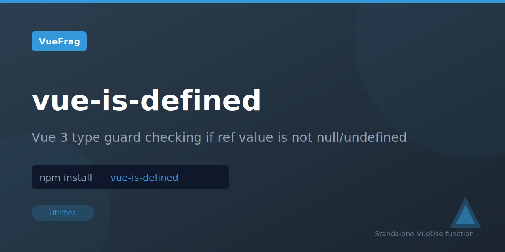

<p align="center">
  
</p>

<h1 align="center">vue-is-defined</h1>

<p align="center">A Vue 3 composition API type guard utility that checks if a ref's value is defined (not null or undefined), with proper TypeScript type narrowing for safe property access.</p>

<p align="center">
  <a href="https://www.npmjs.com/package/vue-is-defined"></a>
  <a href="https://www.npmjs.com/package/vue-is-defined"></a>
</p>

## Installation

```bash
npm install vue-is-defined
```

## Usage

```ts
import { isDefined } from 'vue-is-defined'
import { ref, computed } from 'vue'

const value = ref<string | undefined>('hello')
const defined = isDefined(value)

console.log(defined.value) // true

value.value = undefined
console.log(defined.value) // false
```

## License

MIT

Extracted from [VueUse](https://vueuse.org/) for standalone use.
